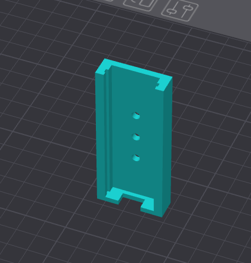

# ESP-PROG Debug Probe Holder

This design provides a mechanism for mounting the ESP-PROG debug probe onto a DIN rail clip.  The three holes in the base of the board allow the holder to be attached to a DIN rail clip.

The ESP-PROG is held in the holder through a friction fitting.

This holder should be printed vertically as experience has shown that the friction fit is tighter when printed this way:

