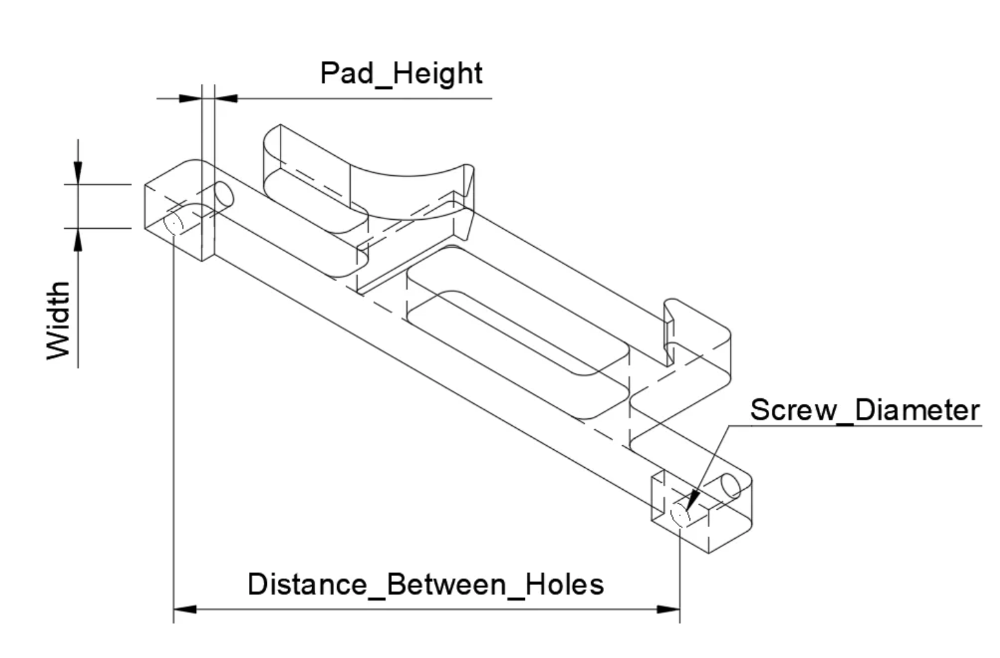

# Parametric DIN Mount

This parametric DIN mount featured on [Printables](https://www.printables.com/en/model/311970-parametric-din-rail-mount-f3d-file) is a Fusion 360 component.  Printing instructions are included on the printable page but are reproduced here for the record.

## Modification Instructions

This can be adjusted to fit about any component that has at least two mounting holes,  the print doesn't require any hardware and its easily mounted and dismounted to DIN rails. If the design has 4 mounting holes you can print two identical DIN mounts, one for each side. 

The design has only four parameters that need to be adjusted:

**Distance_Between_Holes**, this will be the distance between the mounting holes.

**Width** Width of the mount.

**Screw_Diameter**, if threading into the plastic make sure to make the hole slightly smaller (-0.5 mm) than actual screw diameter.

**Pad_Height**, some components may have soldering that interfere with the base, the Pad_Height can be adjusted to elevate the component from the DIN mount, if no Pad_Height is needed set to 0.

## Print Settings

The origin author recommends printing at 35% infill with a minimum of 3 layers for the walls.

I have personally found that 20% infill is sufficient for light weight applications.  Heavy duty applications may require the infill to be increased.