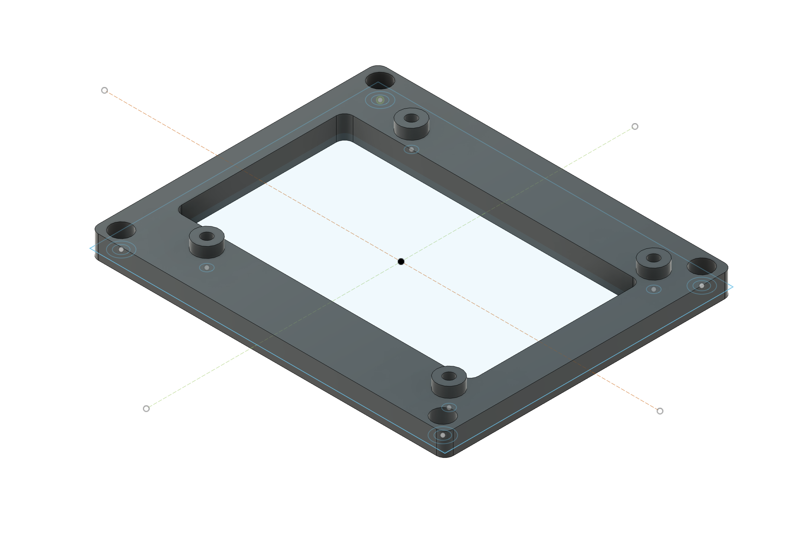
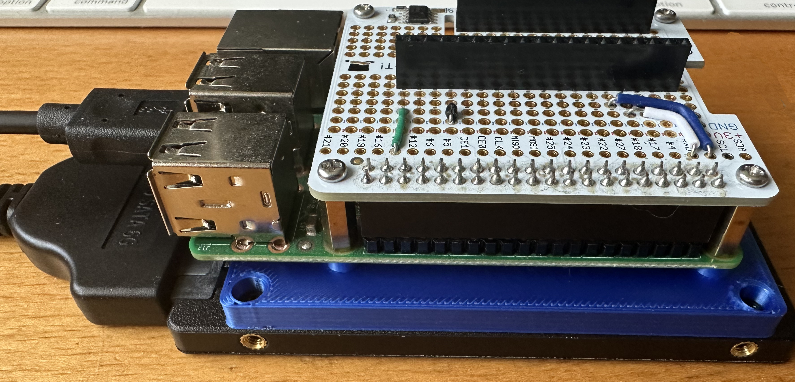

# Pi SSD Mate

This model allows a Raspberry Pi to be mated with a 2.5 inch SSD or other hard drive with this form factor.

And here is the adapter connected to both a Raspberry Pi and 2.5 inch SSD:

