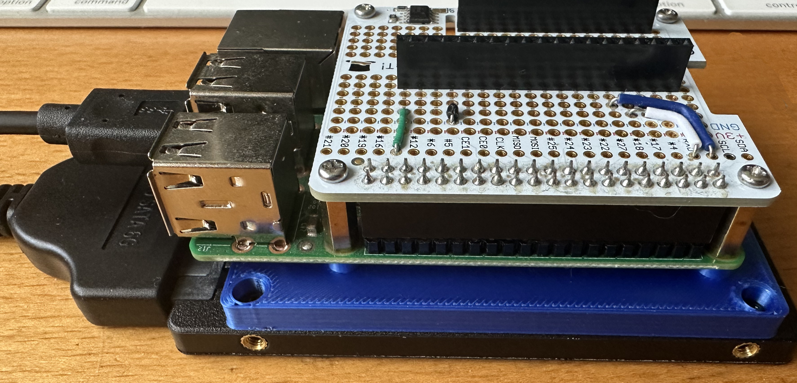

# 3D-Models

Collection of 3D models that have been used to assist in keeping the home hobby office tidy.  The models are created using the personal edition of Fusion 360 which is free for hobby and non-commercial use.

## [PiHddMate](PiHddMate)

This model provides a low profile way of attaching a Raspberry Pi to a 2.5 inch HDD.  This can be seen here as the blue mating connector:

## [Spresense Development Mount](SpresenseDevelopmentMount)

Small mount for the Spresense expansion board:

