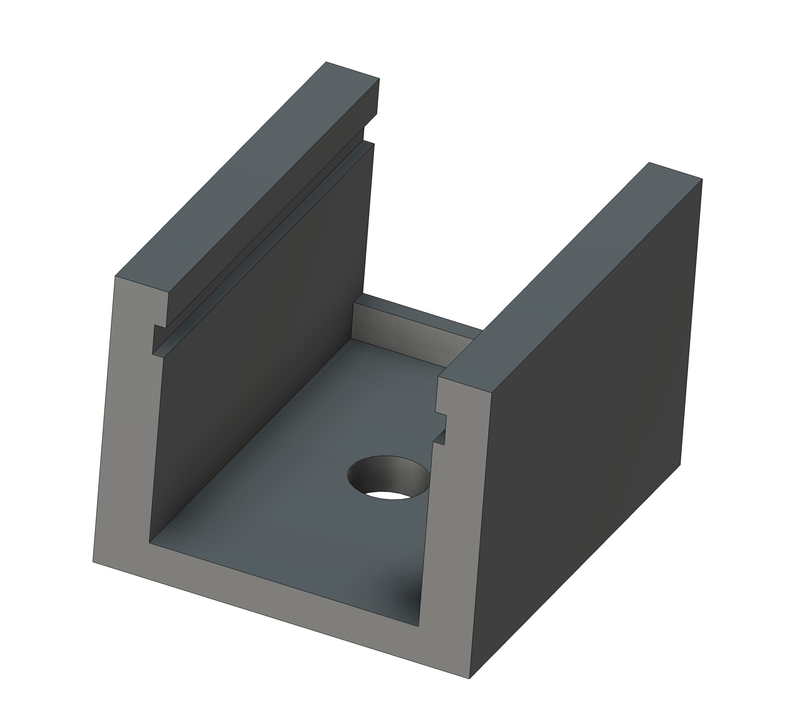
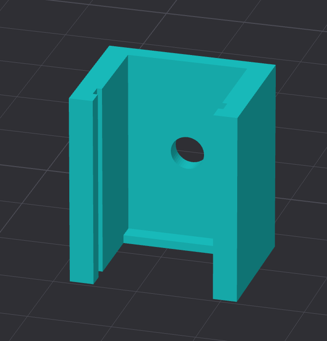

# ST-Link Holder

This design is a small holder for the ST-Link V3 Mini debug probe.  The holder has a single hole to allow it to be attached to a DIN rail clip.

The ST-Link is held in place with a frication fit.  The small raised edge at one end is designed as an end stop for the ribbon cable attached to the ST-Link.

The STL file here is for a long version of the holder with three holes for mounting on a 45mm DIN clip.  This can be changed through the Fusion 360 file.  Open the file and change the <i>HolderLength</i> parameter to the desired length.

This holder should be printed vertically as experience has shown that the friction fit is tighter when printed this way:

