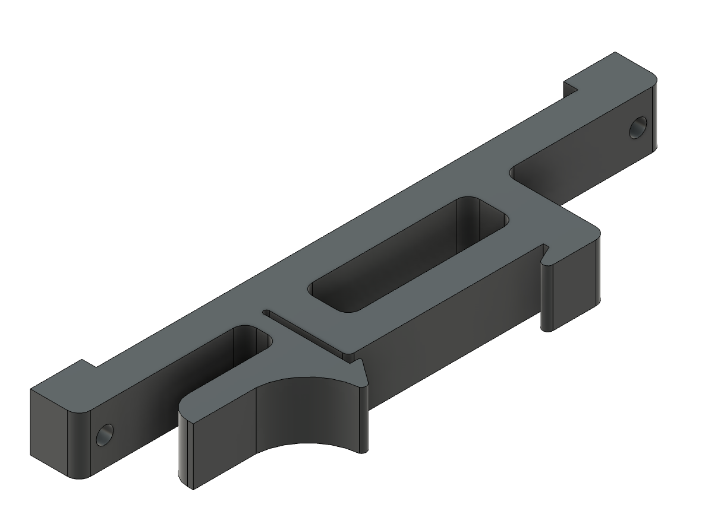

# DIN Mounts

[DIN rails](https://en.wikipedia.org/wiki/DIN_rail) provide an industry standard for mounting circuit breakers and other industrial equipment.  They are also useful in hobby projects allowing controller boards and sensors to be mounted and easily swapped out as the project requirements change over time.

The image below shows a generic DIN clip.  The back of the clip is secured to the DIN rail.  The front of the clip has mounting holes allowing a PCB (or other device) to be mounted to the clip.

The DIN clips listed below are derived from the [parametric DIN mount](../ParametricDINMount/Readme.md) found on [Printables](https://www.printables.com/en/model/311970-parametric-din-rail-mount-f3d-file).

## Wilderness Labs DIN Clips

The DIN mounts use a 2mm screw to attach the board to the DIN mount.  There are two designs, one using a 3.1mm brass inset and one which simply allows the screw to be inserted directly into the plastic.

The generic clip can be attached to the [Project Lab mounts](../ProjectLabV3e/Readme.md) to mount a project lab board to a DIN rail.

* [Generic DIN Mount](GenericDINMount.stl)

### 1.9mm Mounting Hole

* [Dual Ethernet DIN Mount](DualEthernetDINMount-19.stl)
* [Clima 3b](Clima3bDINMount-19.stl)
* [FlexyPin Debug Board](FlexyPinDINMount-19.stl)
* [GPS Tracker](GPSTrackerDINMount-19.stl)

### 3mm Mounting Hole (for Inset)

* [Dual Ethernet DIN Mount](DualEthernetDINMount-30.stl)
* [Clima 3b](Clima3bDINMount-30.stl)
* [FlexyPin Debug Board](FlexyPinDINMount-30.stl)
* [GPS Tracker](GPSTrackerDINMount-30.stl)
