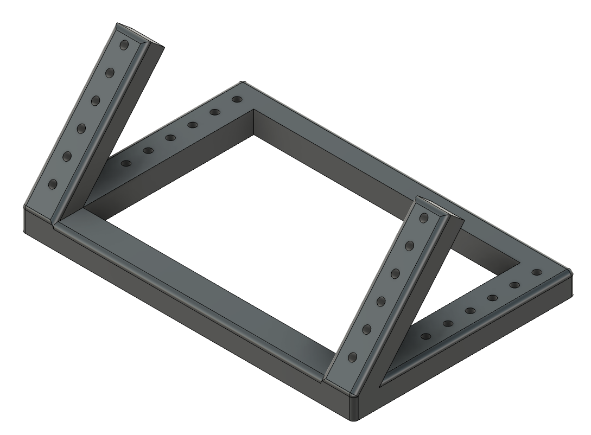
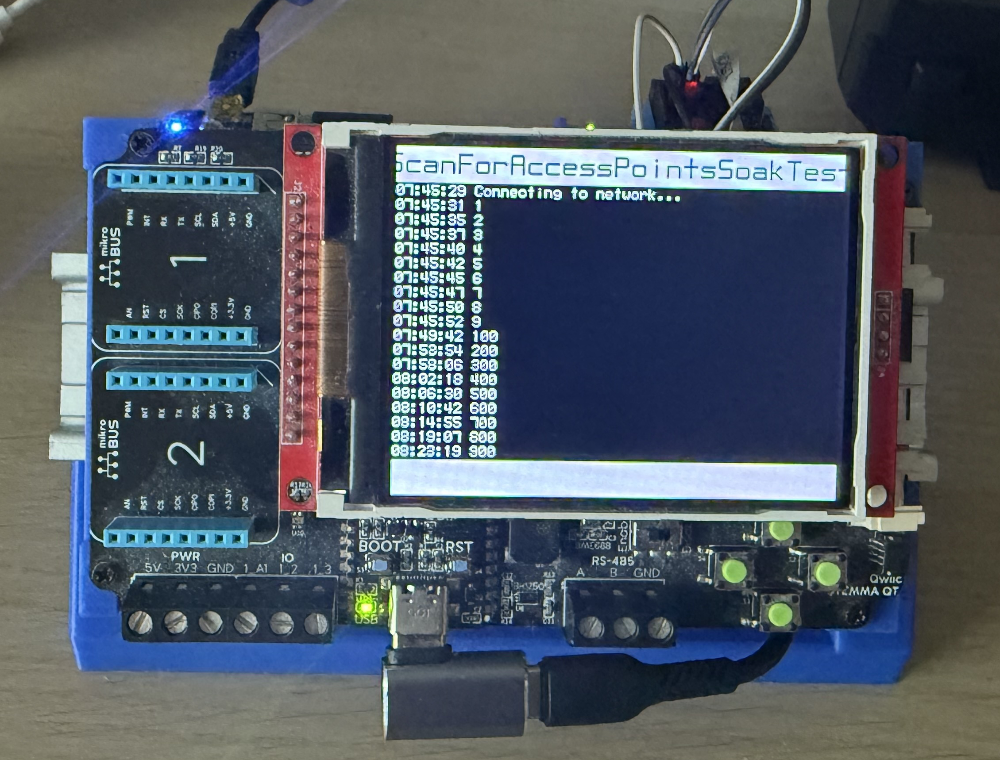

# DIN Mounting Frame

DIN rails allow the creation of a flexible mounting system for project / prototype components.  This frame allows two 150mm DIN rails to be mounted on a supporting frame.  Additional components can then be mounted to these DIN rails:

